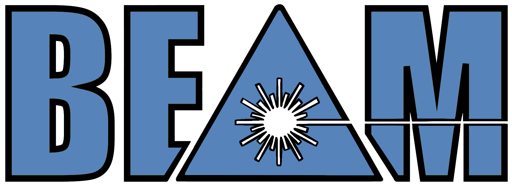

# epyscan


Epyscan generates [EPOCH](https://epochpic.github.io/) campaigns over a parameter space using different sampling methods. Part of [BEAM](#broad-epoch-analysis-modules-beam) (Broad EPOCH Analysis Modules).

## Installation

Install from PyPI with:

```bash
pip install epyscan
```

or from a local checkout:

```bash
git clone https://github.com/PlasmaFAIR/epyscan.git
cd epyscan
pip install .
```

We recommend switching to [uv](https://docs.astral.sh/uv/) to manage packages.

## Usage

Parameter space to be sampled is described by a `dict` where keys
should be in the form of `block_name:parameter`, and values should
be dicts with the following keys:

- `"min"`: minimum value of the parameter
- `"max"`: maximum value of the parameter
- `"log"`: (optional) `bool`, if `True` then grid is done in
  log space for this parameter

```python
import pathlib
import epyscan
import epydeck

# Define the parameter space to be sampled. Here, we are varying the intensity
# and density
parameters = {
  # Intensity varies logarithmically between 1.0e22 and 1.0e24
  "constant:intens": {"min": 1.0e22, "max": 1.0e24, "log": True},
  # Density varies logarithmically between 1.0e20 and 1.0e24
  "constant:nel": {"min": 1.0e20, "max": 1e24, "log": True},
}

# Load a deck file to use as a template for the simulations
with open("template_deck_filename") as f:
  deck = epydeck.load(f)

# Create a grid scan object that will generate 4 different sets of parameters 
# within the specified ranges
grid_scan = epyscan.GridScan(parameters, n_samples=4)

# Define the root directory where the simulation folders will be saved. 
# This directory will be created if it doesn't exist
run_root = pathlib.Path("example_campaign")

# Initialize a campaign object with the template deck and the root directory. 
# This will manage the creation of simulation cases
campaign = epyscan.Campaign(deck, run_root)

# Generate the folders and deck files for each set of parameters in the
# grid scan
paths = [campaign.setup_case(sample) for sample in grid_scan]

# Save the paths of the generated simulation folders to a file
with open("paths.txt", "w") as f:
  [f.write(f"{path}\n") for path in paths]

# Opening paths.txt
# example_campaign/run_0_1000000/run_0_10000/run_0_100/run_0
# example_campaign/run_0_1000000/run_0_10000/run_0_100/run_1
# example_campaign/run_0_1000000/run_0_10000/run_0_100/run_2
# ...
```

## Citing

If epyscan contributes to a project that leads to publication, please acknowledge this by citing epyscan. This can be done by clicking the "cite this repository" button located near the top right of this page.

## Broad EPOCH Analysis Modules (BEAM)



BEAM is structured as a set of independent yet complementary open-source tools designed for analysing [EPOCH](https://epochpic.github.io/) simulations where researchers can adopt only the components they need, without being constrained by a rigid framework. The packages are as follows:

- [sdf-xarray](https://github.com/PlasmaFAIR/sdf-xarray): Reading and processing SDF files and converting them to [xarray](https://docs.xarray.dev/en/stable/).
- [epydeck](https://github.com/PlasmaFAIR/epydeck): Input deck reader and writer.
- [epyscan](https://github.com/PlasmaFAIR/epyscan): Create campaigns over a given parameter space using various sampling methods.
